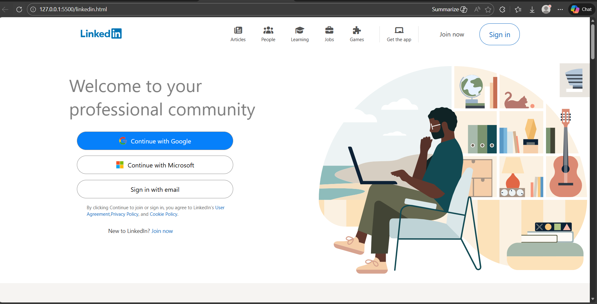
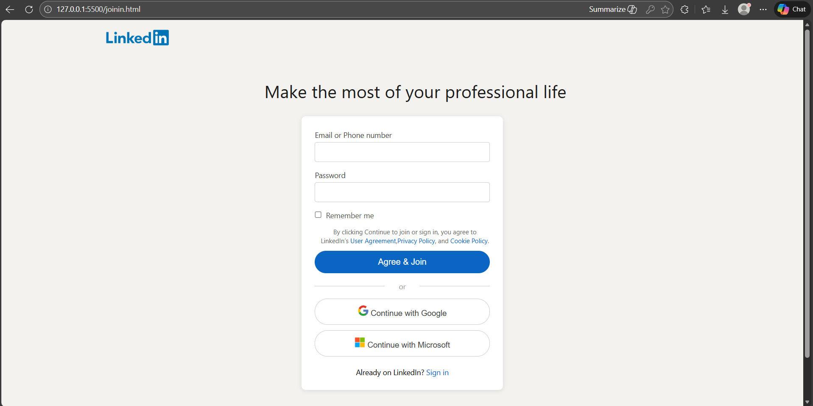
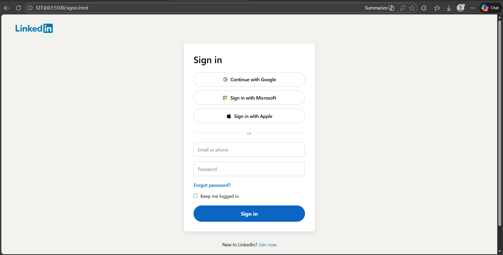

# 💼 LinkedIn Clone (UI)

A frontend **UI clone of LinkedIn** built using **HTML and CSS**. This project focuses on layout design, responsiveness, and recreating a real-world web interface.

---

## 🚀 Features
- LinkedIn-like layout
- Responsive design
- Navigation bar and feed layout
- Profile and sidebar sections

---

## 🛠 Tech Stack
- HTML5
- CSS3 (Flexbox & Grid)

---

## 🧠 What I Learned
- Building complex layouts
- Using Flexbox and CSS Grid
- Improving UI consistency
- Understanding real-world UI structures

---

## 📸 Screenshots

### Home Screen

### Join Now Page

### Sign In Page

---

## 🔗 Live Demo
*([Add GitHub Pages link here](https://varadkharat72.github.io/LinkedIn-Clone/linkedin.html))*

---

## 📌 Future Improvements
- Add JavaScript for interactivity
- Implement login UI
- Convert to React in future
